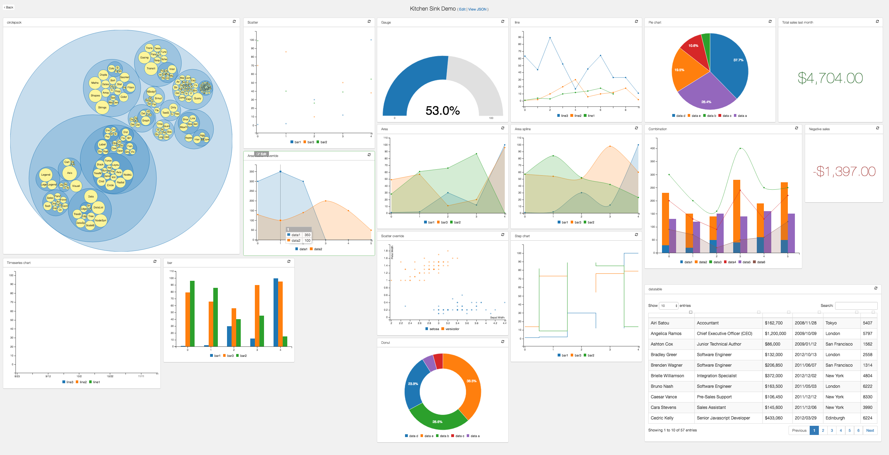
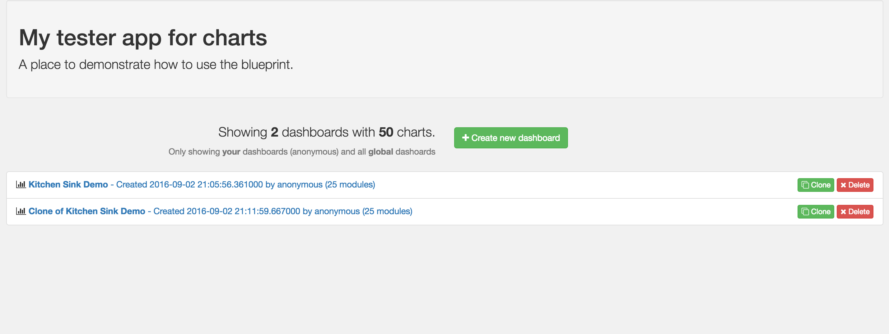
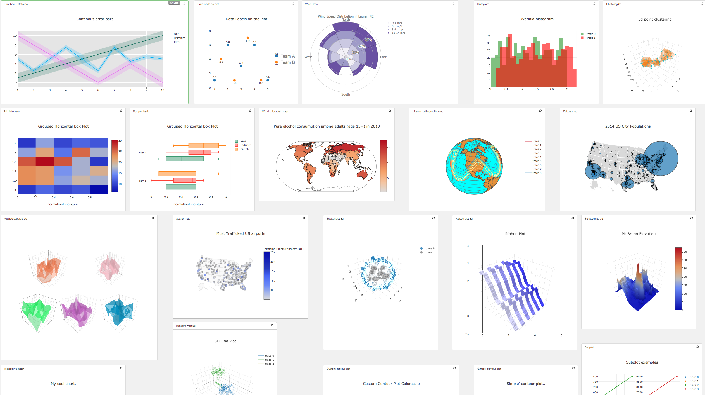

# Flask JSONDash

Easily configurable, chart dashboards from any arbitrary API endpoint. JSON config only. Ready to go.









This project is a [flask blueprint](http://flask.pocoo.org/docs/0.10/blueprints/) that allows you to create sleek dashboards without writing any front end code. It saves JSON configurations for declaring arbitrary charts, leveraging popular libraries like C3.js and D3.js. It also supports templates and iframes, as well as other data visualization libraries. The beauty is that it simply requires a very basic configuration and uses any arbitrary json endpoint to get data, so long as the [payload format is correct](schemas.md).

The dashboard layout and blueprint styles are pre-packaged, and provide only the essentials, while getting out of the way.

## Example configuration / demos

Each chart is very straightforward. Most of the power is leveraged by the various charting libraries. See [schemas](schemas.md) for more detail on how your endpoint json data should be formatted for a given chart.

If you want to see all/most charts in action, you'll need to fire up the `endpoints.py` flask app (included), create a new dashboard, then choose the *edit raw json* option, specifying one of the json files found in [examples/config](examples/config). (This has been tested using mongodb).


## Usage


## Quickstart

Assuming you have Python and pip setup
pip install virtualenvwrapper
cd <wherever you keep your projects>
git clone https://github.com/christabor/flask_jsondash.git
mkvirtualenv flask_jsondash
cd flask_jsondash
pip install -r requirements.txt

Setup MongoDB (Do this in a different shell)
brew install mongodb
mongod --config /usr/local/etc/mongod.conf
ln -sfv /usr/local/opt/mongodb/*.plist ~/Library/LaunchAgents #To enable start of MongoDB on system launch
launchctl load ~/Library/LaunchAgents/homebrew.mxcl.mongodb.plisit #To start mongo now

Optional - You'll have to rely on the defaults or set-up the environment variables yourself

Install foreman - Useful to manage environments and Procfile based app (https://github.com/ddollar/foreman)
gem install foreman #Needs Ruby to be available
Setup the environment variables in a .env. Defaults have been described below. Sample .env file has been included

Start the app
foreman run python app.py
Visit link in your browser


### Requirements

### Core

* Flask
* Jinja2

### Javascript/CSS

These are not included, as you are likely going to have them yourself. If you don't, you'll need to add them:

* Jquery (JS)
* Bootstrap (CSS/JS)

These are necessary and included, based simply on the likelihood they may not alread be used:

* JRespond (JS)
* SugarJS (JS)
* Freewall (JS)

### Charts

Chart requirements depend on what you want to expose to your users. You can configure these in the CHARTS_CONFIG dictionary in the `settings.py` file. You can override these settings by adding your own file, called `settings_override.py`

### Setting environment variables.

Make sure the following env vars are set:

* *CHARTS_DB_HOST* - The DB server hostname (defaults to 'localhost')
* *CHARTS_DB_PORT* - The DB server port (defaults to 27017)
* *CHARTS_DB_NAME* - The DB database name (defaults to 'charts')
* *CHARTS_DB_TABLE* The DB collection name (or sql table name) (defaults to 'views')
* *CHARTS_ACTIVE_DB* The DB backend to use - options: 'mongo', 'postgres' (defaults to 'mongo')

### Starting DB

Make sure to start so json configuration can be saved.

#### Mongodb

Start however you'd like, but usually `mongod` will work.

#### Postgresql

Start however you'd like, but usually `postgres -D /path/to/data/` will work.

### Starting flask app

Either import and use the blueprint in your own flask app, or run `app.py` directly to start the app as-is.

### Starting the test server

Run `endpoints.py` if you'd like to test out existing endpoints to link your chart json to.

### Using remote AJAX endpoints

See `endpoints.py` for examples on how to achieve this. If you do not allow CORS on the server-side, all ajax requests will fail.

### Authentication configuration

By default, no authentication is performed for a given action. However, supporting your own custom auth for each type is just a simple config away. Using the flask pattern of injecting configurations into the `app.config` namespace (in this case, `JSONDASH` must be specified), you can put whichever functions you want, and only those specified will be checked. Here is a working example:

```python

def can_delete_charts():
    return session.get('user')['name'] in SECRET_ADMINS

charts_config = dict(
    auth=dict(
        delete=can_delete_charts,
    ),
)
app.config['JSONDASH'] = charts_config
```

The following types are supported:

`delete`, `clone`, `update`, `create`, `view`

Note: `view` is the only function that takes an argument, which is the ID of the dashboard.

### Metadata configuration

Metadata can be added to the json configuration for further customization purposes. All arbitrary values will expect an accompanying function to be populated with, in the exact same way as the auth functions listed above. They will all be namespaced under the `metadata` key inside of the `app.config['JSONDASH']` dictionary, if specified.

Below is an example of how you can override these fields with your own arbitrary functions. Note: by default, none take arguments. This may change for specific types.

```python
charts_config = dict(
    metadata=dict(
        created_by=get_username,
    ),
)
app.config['JSONDASH'] = charts_config
```

The following metadata overrides are used, but you can also add arbitrary keys and values, *which will be saved to the dashboard config*, just not necessarily used here.

**created_by**

This is used to organize views on the front-page by user, if there is such a key present on the configuration. This key is updated and saved if present, null otherwise.

**user**

This is the current logged in user. This is required for filtering dashboards by user. You must also set the `JSONDASH_FILTERUSERS` flag to `True` in `app.config`.

### Global config flags

Below are global app config flags. Their default values are represented in the example working Python code.

`app.config['JSONDASH_FILTERUSERS'] = False`: for filtering dashboards by the logged in user. See above for setting user data.

`app.config['JSONDASH_GLOBALDASH'] = True`: for allowing "global" dashboards to be shown. These dashboards must have a created_user of "global" or be overriden (see below).

`app.config['JSONDASH_GLOBAL_USER'] = "global"`: An owner name to use when allowing global dashboards to be seen. This is set on the `created_by` property in the specific json config. See above for more examples.

`app.config['JSONDASH_MAX_PERPAGE'] = 50`: The number of results to show per page. Remaining results will be paginated.

## FAQs

**Q**: "Why'd you choose to expose library X, Y, or Z?"

*A*: I tried to go for libraries that are pretty widely known and popular. If you are dissastisfied with what's exposed, you can always add your own by embeddding any js/css and html in a template, and loading it through the `iframe` option.

**Q**: "How do I customize X, Y, Z?"

*A*: Because of the level of abstraction used here, a lot of charts will naturally be less configurable than if they had been scripted by hand. This is the tradeoff with being able to quickly setup a lot of charts easily.

The goal here is to use intelligent defaults as much as possible, and then allow the most universal aspects to be customized through a common interface.

However, you can inject raw json-friendly configurations if your chart has the `override` flag set. This will not work for all charts. See [configuration options](schemas.md) for more.

Keep in mind, many *stylistic* customizations can be overridden in css, since most all charts are html and/or SVG. And, as mentioned above, you can always use override option, or the iframe/custom option and make your `dataSource` endpoint return whatever you want, including a full html/js/css pre-rendered template.

**Q**: "When exposing metadata, why don't you just use the `g` variable and read from that?"

*A*: One way this can be done is using the `@app.before_request decorator`, and populating the `g` variable with metadata. The problem is that it creates extremely unnecessary overhead.

## Tips & tricks

### Using endpoints dynamically

Because the chart builder utilizes simple endpoints, you can use the power of REST to create more complicated views. For example:

`curl -XGET http://localhost:5002/api/foo/`

could return `{"data": [1, 2, 3, 4]}`, but you could customize the url by updating the url saved in your dashboard to support query arguments:

`curl -XGET http://localhost:5002/api/foo?gt=9`

could return `{"data": [10, 20, 30, 40]}` instead!
