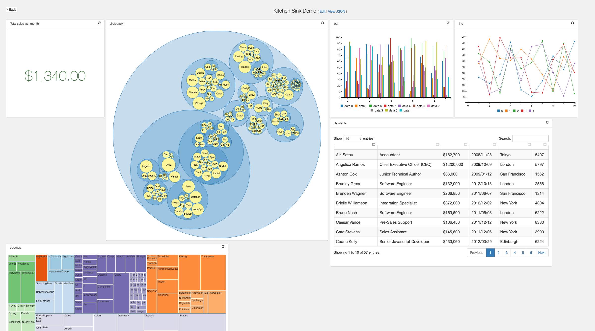
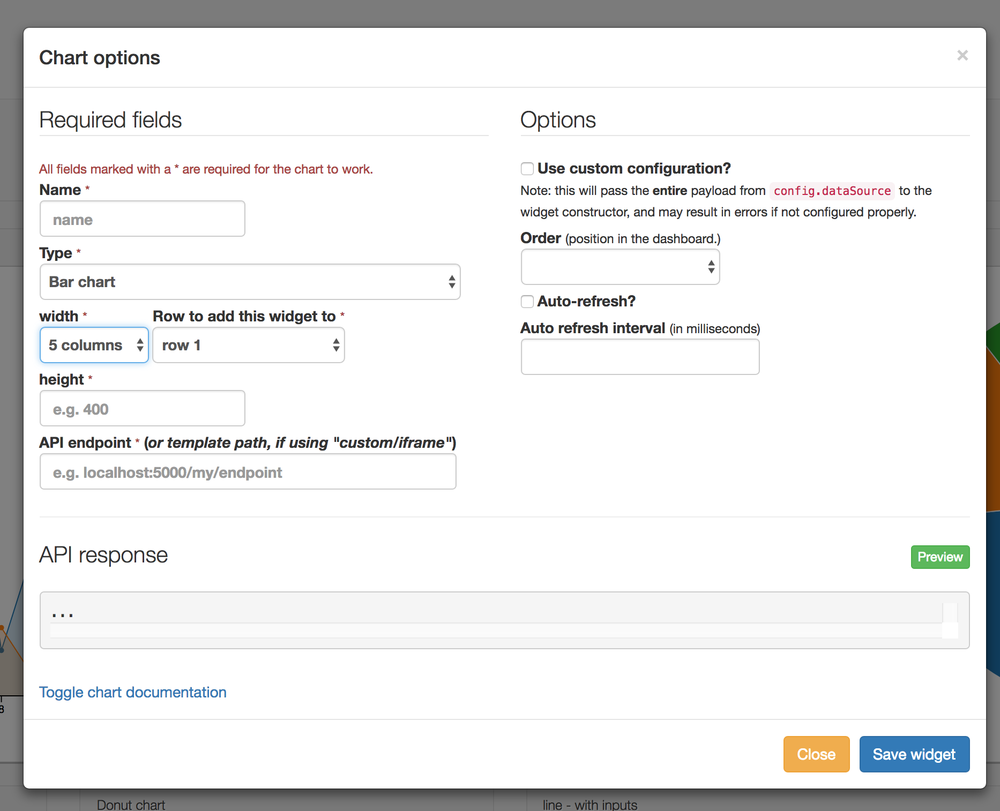
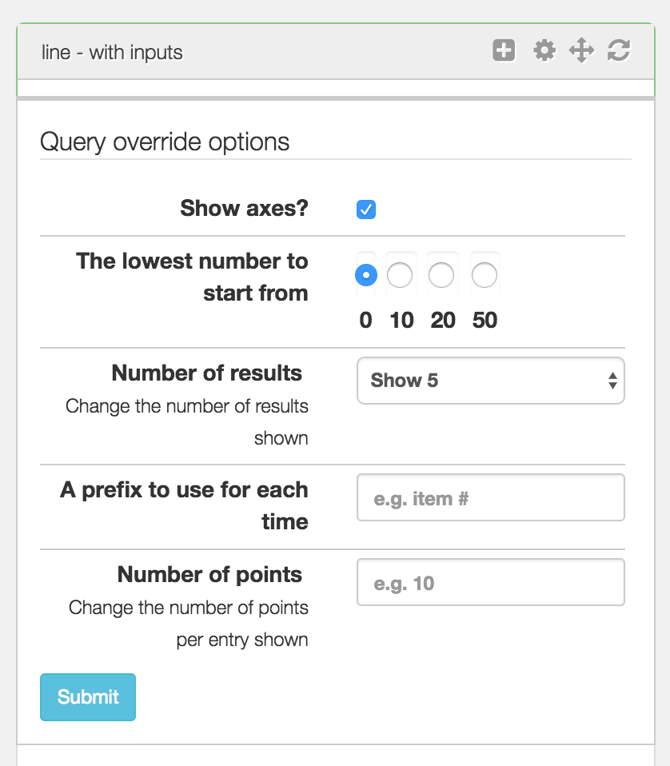

# Flask JSONDash

[](https://codeclimate.com/github/christabor/flask_jsondash)
[](https://scrutinizer-ci.com/g/christabor/flask_jsondash/?branch=master)
[](https://scrutinizer-ci.com/g/christabor/flask_jsondash/build-status/master)
[](https://travis-ci.org/christabor/flask_jsondash)
[](https://www.quantifiedcode.com/app/project/df272477c0ff423ca51fa4106c1e9ebc)
[](https://landscape.io/github/christabor/flask_jsondash/master)
[](https://coveralls.io/github/christabor/flask_jsondash?branch=master)

Easily configurable, chart dashboards from any arbitrary API endpoint. JSON config only. Ready to go.







This project is a [flask blueprint](http://flask.pocoo.org/docs/0.10/blueprints/) that allows you to create **sleek dashboards** without writing any front end (or backend) code. Everything is powered through simple JSON configurations for declaring arbitrary charts.

## Features

* Leveraging popular libraries like C3.js and D3.js, and **MUCH MORE**.
* Also supports templates and iframes
* Only a basic intuitive configuration is required.
* The dashboard layout and blueprint styles are pre-packaged, and provide only the essentials, while getting out of the way.
* Drag-and-drop your layout easily and intuitively
* Multiple layout modes - **bootstrap grid** based or totally **freeform**

It uses any specified json endpoint to get data from, so long as the [payload format is correct](docs/schemas.md).

## JSON configurations intro

The configuration JSON provides core functionality and is at the heart of the project. There are several comprehensive examples available in the [examples/config](example_app/examples/config) directory to give you an idea of how it works, as well as the [core configuration documentation](docs/config.md). An simple example:

```json
{
    "modules": [
        {
            "type": "timeseries",
            "name": "name3",
            "width": 510,
            "height": 400,
            "dataSource": "http://localhost:5001/test1",
            "order": 0
        }
    ]
}
```

*(4.0 and later)* You can even provide custom inputs to allow interactivity on each chart!

E.g.

```json
{
    "modules": [
        {
            "name": "line",
            "height": "400",
            "width": "500",
            "dataSource": "http://127.0.0.1:5004/custom-inputs",
            "override": false,
            "guid": "a6eb10e7-26fa-7814-818a-3699b24415c5",
            "type": "line",
            "inputs": {
                "btn_classes": ["btn", "btn-info", "btn-sm"],
                "submit_text": "Submit",
                "options": [
                    {
                        "type": "number",
                        "name": "entries",
                        "input_classes": ["form-control", "input-sm"],
                        "label": "Number of points",
                        "help_text": "Change the number of points per entry shown"
                    }
                ]
            }
        }
    ]
}
```

Which will map to query parameters (`entries=10` in this example) that you can use to filter or change what your endpoint returns!

Also note that the order of the inputs in the json will determine their order in html.

Below is an example output using a custom input configuration:



See the [examples/config](example_app/examples/config) directory for all the supported options.

## Demo

If you want to see all/most charts in action, you'll need to fire up the `endpoints.py` flask app (included) alongside your main app that uses the blueprint, create a new dashboard, then choose the *edit raw json* option, specifying one of the json files found in [examples/config](example_app/examples/config). (This has been tested using mongodb).

### Various chart schemas JSON formats

Each chart is very straightforward. Most of the power is leveraged by the various charting libraries that flask-jsondash defers to. See [schemas](docs/schemas.md) for more detail on how your endpoint json data should be formatted for a given chart type, as well as how to find docs for each supported library.

## Usage

### Quickstart

**Method 1 - use provided flask app**

```shell
git clone https://github.com/christabor/flask_jsondash.git
cd flask_jsondash
virtualenv env
source env/bin/activate
python setup.py install
cd example_app
python app.py
```

This will setup the app in a virtual environment and run the included test app (`app.py`) immediately on port `8080`.

If you want to import the blueprint into your own existing flask instance:

**Method 2 - use your existing app**

```shell
pip install flask-jsondash
```

Your app will need to import and register the blueprint, as well as have the appropriate template tags. [An example of this can be found here](example_app/templates/layouts/base.html).

**Method 3 - Docker**

Assuming you have docker *and* docker-compose installed:

```shell
git clone https://github.com/christabor/flask_jsondash.git
make dockerize
```

This will build the base and services images, setup your docker services and link them together. The endpoints will run on `0.0.0.0:5004` by default, and your app is available at `0.0.0.0:8080`.

*Note that there are three docker files, a base and then inheriting ones. This is a way to speed up subsequent app-specific builds without having to reinstall python and update apt repos*

*Note, for any serious usage, you'll always want to configure external volumes for mongodb, so that your data is persisted OUTSIDE of docker.*

#### Python 3.x usage

The above should work, but you'll need to use the python 3.x equivalent for all of the operations; e.g.:

```
...
virtualenv -p python3 env
python3 setup.py install
python3 app.py
```

### Requirements

#### Core

* Flask
* Jinja2

#### Javascript/CSS

These are not included, as you are likely going to have them yourself. If you don't, you'll need to add them:

* Jquery (JS)
* Bootstrap (CSS/JS)

These are necessary and included, based simply on the likelihood they may not already be used:

* JRespond (JS)
* Masonry (JS)
* Jquery UI (CSS/JS)

### Setting environment variables.

Make sure the following env vars are set:

* `CHARTS_DB_HOST` - The DB server hostname (defaults to 'localhost')
* `CHARTS_DB_PORT` - The DB server port (defaults to 27017)
* `CHARTS_DB_NAME` - The DB database name (defaults to 'charts')
* `CHARTS_DB_TABLE` The DB collection name (or sql table name) (defaults to 'views')
* `CHARTS_ACTIVE_DB` The DB backend to use - options: 'mongo' (default)

### Starting DB

Make sure to start so json configuration can be saved.

#### Mongodb

Start however you'd like, but usually `mongod` will work. *Note: you will need to make sure the collection has been created within your mongo instance, and is specified in the CHARTS_DB_TABLE env var, as well as specify your database name under the CHARTS_DB_NAME env var*

### Starting flask app

Either import and use the blueprint in your own flask app, or run `app.py` directly to start the app as-is.

### Starting the test server

Run `endpoints.py` if you'd like to test out existing endpoints to link your chart json to.

### Using remote AJAX endpoints

See `endpoints.py` for examples on how to achieve this. If you do not allow CORS on the server-side, all ajax requests will fail.

## Customization

Beyond the above outlined configurations that power the core of jsondash, there are more ways to control how the application works.

### Flask configuration

#### Authentication

By default, no authentication is performed for a given action. However, supporting your own custom auth for each type is just a simple config away. Using the flask pattern of injecting configurations into the `app.config` namespace (in this case, `JSONDASH` must be specified), you can put whichever functions you want, and only those specified will be checked. Here is a working example:

```python

def can_edit_others(view_id=None):
    if view_id == '...' and session.get('user')['name'] in SECRET_ADMINS:
        return True
    return False

def can_delete_charts():
    return session.get('user')['name'] in SECRET_ADMINS

charts_config = dict(
    auth=dict(
        edit_others=can_edit_others,
        delete=can_delete_charts,
    ),
)
app.config['JSONDASH'] = charts_config
```

See below for the supported types and their details.

#### Authentication types

**edit_global**

This determines if a user can create *OR* update a chart with the "global" flag set, which will show the dashboard to all users *if* the appropriate application flags are set ([see global config flags below](https://github.com/christabor/flask_jsondash#global-config-flags)) If no flag is set for allowing global dashboards, then this option will not be available.

**delete**

Allows deleting of charts.

**clone**

Allows cloning of charts.

**update**

Allows updating of charts.

**create**

Allows creation of new charts.

**view**

Allows viewing of a chart. The provided function will be passed the `id` of the view as a `view_id` kwarg.

**edit_others**

Allow editing of other creators' charts. The provided function will be passed the `id` of the view as a `view_id` kwarg. If the created_by matches the logged in user, it will automatically be allowed, regardless of the auth override.

#### Metadata configuration

Metadata can be added to the json configuration for further customization purposes. All arbitrary values will expect an accompanying function to be populated with, in the exact same way as the auth functions listed above. They will all be namespaced under the `metadata` key inside of the `app.config['JSONDASH']` dictionary, if specified.

Below is an example of how you can override these fields with your own arbitrary functions. Note: by default, none take arguments. This may change for specific types.

```python
charts_config = dict(
    metadata=dict(
        created_by=get_username,
    ),
)
app.config['JSONDASH'] = charts_config
```

The following metadata overrides are used, but you can also add arbitrary keys and values, *which will be saved to the dashboard config*, just not necessarily used here.

**created_by**

This is used to organize views on the front-page by user, if there is such a key present on the configuration. This key is updated and saved if present, null otherwise.

**user**

This is the current logged in user. This is required for filtering dashboards by user. You must also set the `JSONDASH_FILTERUSERS` flag to `True` in `app.config`.

#### Global config flags

Below are global app config flags. Their default values are represented in the example working Python code.

`app.config['JSONDASH_FILTERUSERS'] = False`: for filtering dashboards by the logged in user. See above for setting user data.

`app.config['JSONDASH_GLOBALDASH'] = True`: for allowing "global" dashboards to be shown. These dashboards must have a created_user of "global" or be overridden (see below).

`app.config['JSONDASH_GLOBAL_USER'] = "global"`: An owner name to use when allowing global dashboards to be seen. This is set on the `created_by` property in the specific json config. See above for more examples.

`app.config['JSONDASH_MAX_PERPAGE'] = 50`: The number of results to show per page. Remaining results will be paginated.

#### Static asset config options

By default, all assets (css/js) will be loaded remotely by popular CDNs recommended for the given charting library.

However, you might want to ensure assets are always available, or cannot access them because of network/proxy issues. If you would like to use your own local assets specified inside of the [settings.py](flask_jsondash/settings.py) file, you can download them, put them in your app somewhere, and then tell jsondash where they should be loaded from (using the standard flask `url_for('static', filename=XXX)` pattern.)

Just add a `static` key in your `JSONDASH` config with these values like so:

```python
app.config['JSONDASH'] = dict(
    static=dict(
        js_path='js/vendor',
        css_path='css/vendor',
    )
)
```

With default flask static settings, this would resolve the url to `/static/js/vendor/filename.js` for example.

You can use one or the other, but it's recommended to use both or none.

### Jinja template configuration

The following blocks are used in the master template:

1. `jsondash_body`: required for the entire layout :heavy_exclamation_mark:
2. `jsondash_css`: required for loading the css :heavy_exclamation_mark:
3. `jsondash_js`: required for loading the js :heavy_exclamation_mark:
4. `jsondash_api_scripts`: optional if you want to register callbacks (see below) :heavy_check_mark:
5. `jsondash_init`: required to initialize the dashboards :heavy_exclamation_mark:
6. `jsondash_title`: optional if you want to override or augment your page title. :heavy_check_mark:

You can just check out the [example app](example_app/templates/layouts/base.html) to see how it all should work.

### JavaScript configuration

#### Custom callbacks

While the point of jsondash is to make front-end coding completely unnecessary, and use serializable declarative configurations for making dashboards, sometimes you need to do one off stuff that requires scripting. A callback module exists to allow this very easily without getting in the way of existing configurations.

You can customize individual charts by adding your own javascript files alongside your existing app that uses this blueprint and then register call backs on a *per-chart id basis*. All callbacks will be run in the order you register them, after the chart has been loaded and rendered completely.

To get started: override the template block in your template to allow javascript to be executed, and register a callback with your own arguments.

```html

<script>
    jsondash.api.registerCallback('my-chart-guid', function(container, config, myargs){
            console.log('Running FIRST callbacK!');
            console.log(myargs[0]);
            console.log(myargs[1]);
            container.style('background-color', 'green');
            console.log(config.guid);
    }, ['all', 'my', 'optional', 'arguments']);
    // Register a second one, which runs after.
    jsondash.api.registerCallback('my-chart-guid', function(container, config){
            console.log('Running SECOND callbacK!');
    });
</script>

```

All callbacks will be passed the following arguments order:

1. `container`: The d3 selector for the chart container.
2. `config`: The json object configuration for this chart.
3. `args`: The array of arguments you supplied when registering the callback.

To see a list of all your callbacks by chart, you can call `jsondash.api.listCallbacks()`;

## Versioning

This project uses [semantic versioning](http://semver.org) for releases. However, the **master branch is considered to be unstable** as it represents "bleeding edge", with updates, hotfixes, etc... which will eventually get tagged with a release. If you want to use a stable version, *make sure to pin the specific release* you want to target.

## FAQs

**Q**: "Why'd you choose to expose library X, Y, or Z?"

*A*: I tried to go for libraries that are pretty widely known and popular. If you are dissatisfied with what's exposed, you can always add your own by embedding any js/css and html in a template, and loading it through the `iframe` option.

**Q**: "How do I customize X, Y, Z?"

*A*: Because of the level of abstraction used here, a lot of charts will naturally be less configurable than if they had been scripted by hand. This is the tradeoff with being able to quickly setup a lot of charts easily.

The goal here is to use intelligent defaults as much as possible, and then allow the most universal aspects to be customized through a common interface.

However, you can inject raw json-friendly configurations if your chart has the `override` flag set. This will not work for all charts. See [configuration options](docs/schemas.md) for more.

Keep in mind, many *stylistic* customizations can be overridden in css, since most all charts are html and/or SVG. And, as mentioned above, you can always use override option, or the iframe/custom option and make your `dataSource` endpoint return whatever you want, including a full html/js/css pre-rendered template.

**Q**: "When exposing metadata, why don't you just use the `g` variable and read from that?"

*A*: One way this can be done is using the `@app.before_request decorator`, and populating the `g` variable with metadata. The problem is that it creates extremely unnecessary overhead.

## Tips & tricks

### Using the included data utils

Check out [data utils](docs/data_utils.md) for more.

### Using endpoints dynamically

Because the chart builder utilizes simple endpoints, you can use the power of REST to create more complicated views. For example:

`curl -XGET http://localhost:8080/api/foo/`

could return `{"data": [1, 2, 3, 4]}`, but you could customize the url by updating the url saved in your dashboard to support query arguments:

`curl -XGET http://localhost:8080/api/foo?gt=9`

could return `{"data": [10, 20, 30, 40]}` instead!

### Generating test data

Included are CLI utilities for generating fake charts, etc. You will need to run them like a python package due to their relative import style which is required for py2/p3 compatibility. To run, for example, the model factory generator, run `python -m flask_jsondash.model_factories --records 10`. For python3.x, just replace that with `python3 -m ...`.

### Using the demo mode

If you append the query argument `jsondash_demo_mode=1` to your url (e.g. `...?jsondash_demo_mode=1`, the UI will automatically hide any dashboard edit buttons and back button. This can be used for example, for displaying on a mounted screen to hide extraneous details.

### Using gist.github.com

While the data is not dynamically generated, you can easily use Github gists (or any raw file from github.com for that matter) to load charts! Check out the [kitchensink dashboard](example_app/examples/config/kitchensink.json) to see a real working chart loaded from via gist!

### Embedding graphs from other resources

For example, the build tool Jenkins provides a [plugin for build statistics](https://wiki.jenkins-ci.org/display/JENKINS/Global+Build+Stats+Plugin). The raw generated png (url is typically of the format https://{JENKINS_SERVER}/view/{VIEW_NAME}/job/{JOB_NAME}/buildTimeGraph/png) can be directly embedded using the `iframe` chart option.

## Performance

Performance metrics are not available, but you can view some "stress test" examples for the example endpoints. The configuration for these are available in [examples/config/stresstest.json](example_app/examples/config/stresstest.json). Also, the comprehensive examples (plotly, kitchensink) above are very complex dashboards (20-30 charts, webgl, etc), and have been tested in the browser.

A couple observations on stress tests
*(performed on Macbook Pro / 16gb / 2.7ghz i7):*

* Native D3.js handles large datasets very well. It handled 1-2mb json files with no problem.
* Datatables handles extremely large datasets with no problem. Maximum tested before degradation was around 100,000 rows.
* C3.js starts to lag heavily and spends a good 10 seconds and in some cases crashed Google Chrome (with multiple charts on the page) when updwards of 2-300 data points are used per chart (the example config has 10 charts).

Your performance may be better or worse, so just test it out. As always, Your Mileage May Vary.

## Debugging/Troubleshooting

**My chart won't load even though the url is correct!**

:x: *http issues*

If your site is using `https` (it should be), this is likely caused by an issue with third-parties not using it, but instead running an insecure http web server. This is unfortunately not easy to fix, unless you:

* Make your site insecure by no longer have an SSL certificate (not preferable)
* Tell the owner of the endpoint to enforce SSL on their end and provide https.

:x: *javascript issues*

To troubleshoot potential javascript parse errors, open up your browser console (In Chrome for example, it's <kbd>cmd+option+i</kbd> for Mac, and <kbd>ctrl+alt+i</kbd> on Windows) and see if there are any errors. If there are any parse errors, then the format of your json response may be invalid for a given content type. [Make sure to check the schemas page for format requirements](docs/schemas.md)

**My chart is ugly or is flowing outside the container**

This is usually only an issue with datatables, particularly when selecting the number of entries to show. The size of the table will grow, and the layout does not account for that, nor should it. The best case here is to determine what size actually makes sense for you and adjust your chart size accordingly.

You can also use the override option supported by this chart, and specify the number of results per page, and the number of entries that can be shown. See the [datatables schema docs](docs/schemas.md#datatables) for more.

## Contributing/Development

If you'd like to work on the project, a good place to start is using the example app to develop against. To do this easily, you'll want to setup a virtual environment and setup the package locally, using the `develop` mode of `setuptools`. The below should get you started:

```shell
git clone github.com/christabor/flask_jsondash.git
cd flask_jsondash
virtualenv env
source env/bin/activate
git checkout -b YOUR_NEW_BRANCH
python setup.py develop
cd example_app
python app.py
```

And voila! You can now edit the folder directly, and still use it as a normal pip package without having to reinstall every time you change something.

## Tests

To run all tests for python 2.7 and 3.x, with coverage, just run `tox` (assuming tox is installed.)

### Python

You can run these tests using pytest (`pip install -U pytest`) and then in the existing virtualenv, run `pytest tests`.

If you are having issues with this approach, an alternative would be to install pytest within the projects' virtualenv (assuming you've created one), and then running it like so: `python -m pytest tests`.

#### Test coverage

To find coverage information (assuming `pytest-cov` is installed), you can run: `pytest tests -s --cov=flask_jsondash`.

### Javascript

JS tests are run using the node library Jasmine. To install and run it, you'll need nodejs installed, then the package: `npm install -g jasmine`. You can then `cd` into the `tests_js` folder and run the provided python script `python runner.py`
